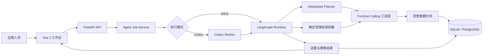

# 智能电商运营 Agent

面向电商运营诊断、商品经营、用户分层、活动策略和风险审批的企业级 AI Agent 演示项目。

项目采用 **LangGraph + Function Calling + FastAPI + Vue 3** 构建，将大模型的意图理解与解释能力，和可验证的数据分析工具结合起来。即使没有真实电商平台、内部数据或模型 API Key，也可以通过可复现的 90 天模拟数据完整演示 Agent 的规划、工具调用、证据生成、策略建议、人工审批和运行评估流程。

> 本项目未接入淘宝、京东等真实平台，不是生产交易系统。页面中的经营数据、预测和活动收益均为模拟结果，用于展示工程能力和 Agent 设计方法。

## 项目亮点

- **真实 Agent 编排**：使用 LangGraph 定义状态和执行节点，完成上下文加载、任务执行、取消判断与结果收敛。
- **结构化 Function Calling**：向模型暴露白名单工具 Schema，校验工具名称、JSON 参数、调用数量和重复调用，避免任意代码执行。
- **混合决策架构**：DeepSeek 负责意图识别、任务规划和结果解释；Python 工具负责指标计算、经营规则和风险判断。
- **可靠降级**：未配置 API Key、模型超时或返回异常时，自动使用确定性规划器，保证演示链路仍然可用。
- **异步任务运行时**：分析请求创建持久化 Job，通过状态和事件记录展示执行过程，支持取消、幂等键和 Celery 队列执行。
- **数据分析闭环**：覆盖 GMV 归因、转化漏斗、ABC 商品分层、RFM 用户分层、活动增量 ROI、竞品价格和 GMV 预测。
- **可审计的人机协同**：建议、审批意见、版本号和操作记录持久化；高风险策略必须经过人工审批。
- **可观测与可评估**：记录模型、执行模式、耗时、Token、工具轨迹和降级原因，并提供 40 条场景评测集。
- **动态商品模拟**：可推进模拟日期，生成大促、差评、库存、补货、竞品降价和广告优化事件，页面数据随事件变化。

## 系统架构



## 多 Agent 协作

主流程采用 LangGraph Supervisor 执行图，不再以“生成运营方案”为终点：

| Agent | 职责 | 工具权限 |
|---|---|---|
| Supervisor | 识别执行目标、目标商品和参数，路由专业 Agent | 只规划，不写业务数据 |
| Catalog Agent | 读取商品价格、成本、上下架状态和版本 | 商品系统只读工具 |
| Pricing Agent | 校验调价幅度、成本底线和毛利率 | 定价策略工具 |
| Listing Agent | 准备上架或下架变更 | 商品状态工具 |
| Marketing Agent | 创建活动预算、渠道和优化规则 | 营销活动工具 |
| Risk Agent | 判定风险等级和审批原因 | 策略与权限规则 |
| Approval Gate | 使用 LangGraph `interrupt` 暂停执行 | 人工审批，不能绕过 |
| Tool Executor | 批准后恢复执行图，写回业务状态并生成回执 | 受控写工具与回滚工具 |

每个 Agent 只处理自己的状态字段和工具权限。任务状态、事件、版本、错误与执行回执持久化到数据库，前端展示完整执行轨迹。

## Agent 执行流程

1. 用户用自然语言下达上架、下架、调价或创建营销活动任务。
2. Supervisor 解析动作、商品和参数，并路由 Pricing、Listing 或 Marketing Agent。
3. Catalog Agent 读取当前业务状态，专业 Agent 执行参数计算与策略校验。
4. Risk Agent 生成审批原因，LangGraph `interrupt` 将任务暂停在审批断点。
5. 用户批准后，后端通过 `Command(resume=...)` 恢复原执行图。
6. Tool Executor 调用白名单业务工具，实际修改模拟商品状态或创建营销活动回执。
7. 系统保存执行前后快照、任务事件和版本号，并支持价格与上下架变更回滚。

模型不能直接修改数据库、执行任意代码或绕过审批。所有写操作只能由 Tool Executor 使用经过参数校验的白名单工具完成。

当前已完成主管调度、五专员权限与交付物、“新品从 0 到上架”完整团队链路、审批和沙箱执行。每个专员拥有按工作区隔离的长期策略记忆，定价底线、广告预算、Listing 合规要求等会直接约束交付物；系统同时提供 Heartbeat/Cron 主动巡检、手动触发和订单、退货、库存、差评 Webhook 入口。飞书、Telegram 等外部消息渠道和真实电商平台连接器仍属于后续阶段。

配置 `DEEPSEEK_API_KEY` 后，DeepSeek 主管会实际选择所需专员并汇总五类交付物，执行模式记录为 `openclaw_team_llm`，同时保存 Token 用量。模型超时、网络异常或返回未知角色时，系统拒绝非法路由并切换到确定性主管，记录明确的降级原因。

## 数据分析能力

| 分析模块 | 核心指标与方法 | 业务用途 |
|---|---|---|
| GMV 诊断 | 流量、转化率、客单价三因子归因 | 定位销售额变化原因 |
| 转化漏斗 | 曝光、访问、加购、结算、支付转化 | 识别关键流失环节 |
| 商品经营 | ABC 分层、毛利率、库存周转、评分、广告 ROI | 选品、补货与淘汰决策 |
| 用户运营 | RFM、复购率、模拟 LTV | 用户分群与差异化触达 |
| 活动分析 | 增量 GMV、成本、增量 ROI | 评估活动效果和预算分配 |
| 竞品分析 | 价格指数、价差、竞争状态 | 调价和促销策略 |
| 趋势预测 | 7 天 GMV 模拟预测 | 经营目标和库存规划 |

数据生成器使用固定随机种子构造 90 天订单、流量、广告、库存、评价、客户、活动和竞品价格数据，因此结果可复现，也便于自动化测试。

## 功能页面

- **团队与自动化**：查看五个专员的独立策略记忆，维护定价、广告、Listing 和客服边界；启停或立即运行广告日报、竞品价格、库存与差评巡检。
- **执行型运营 Agent**：自然语言创建业务任务，展示多 Agent 路由、策略校验、审批断点、工具执行、前后快照和回滚回执。
- **运营驾驶舱**：GMV 趋势、经营指标、归因、漏斗和预测。
- **商品分析**：ABC 分类、库存、毛利、广告、评价和竞品价差。
- **客户分析**：RFM 分层、复购率、客户价值和人群结构。
- **活动策略**：按增长目标动态选品，生成差异化打法和模拟收益。
- **运行中心**：执行模式、成功率、降级率、Token、耗时和 P95 延迟。
- **Agent 评估**：意图、工具、参数、证据和风险准确率。
- **商品模拟**：推进日期或重置模拟，观察经营指标随事件变化。
- **跨境增长工作流**：Market Research、Listing、Compliance、Human Approval 和 Sandbox Publisher 五阶段协作，从市场洞察推进到受控模拟发布。

## 跨境增长闭环

```text
Market Research Agent
  → Listing Writer Agent
  → Compliance Reviewer Agent
  → Human Approval
  → Sandbox Publisher
```

Market Research Agent 使用项目内商品经营、竞品价格和评价主题生成机会评分；Listing Writer 输出平台标题、五点描述与搜索词；Compliance Reviewer 检查绝对化用语、医疗宣称和标题长度。工作流快照持久化在审批建议中，Publisher 会从数据库重新读取审批状态，未审批或合规未通过时返回 `409`。发布仅生成确定性沙箱回执，不调用真实 Amazon、Temu 或 Walmart。

## 技术栈

| 层级 | 技术 |
|---|---|
| Agent | LangGraph、LangChain Core、OpenAI-compatible Function Calling、DeepSeek |
| 后端 | Python 3.11、FastAPI、Pydantic、SQLAlchemy Async、Alembic |
| 异步任务 | Celery、Redis（队列模式可选） |
| 数据存储 | SQLite（本地演示）、PostgreSQL（生产配置） |
| 前端 | Vue 3、TypeScript、Element Plus、Pinia、Vite |
| 质量保障 | pytest、Playwright、vue-tsc、Docker Compose |

## 目录结构

```text
backend/
  api/ecommerce.py                 电商 API 与 Agent Job 接口
  ecommerce/agent/                 混合 Agent、规划器和工具注册表
  ecommerce/analytics/             经营分析算法
  ecommerce/runtime/               LangGraph、Function Calling、Job Service
  ecommerce/persistence/           会话、运行、建议、任务和事件仓储
  tasks/ecommerce_agent_task.py    Celery Agent 任务
  db/alembic/                       数据库迁移
frontend/src/views/Ecommerce/      电商运营工作台页面
data/ecommerce/                    可复现模拟数据与评测集
scripts/                            数据生成和 Agent 评估脚本
tests/                              后端、API、运行时和业务测试
docs/                               架构、设计和简历说明
```

## 快速启动

### 1. 安装依赖

```powershell
python -m venv .venv
.venv\Scripts\python.exe -m pip install -r requirements-dev.txt
.venv\Scripts\python.exe -m pip install -r backend\requirements-langchain.txt

cd frontend
npm install
cd ..
```

### 2. 配置环境变量

```powershell
Copy-Item .env.example .env
```

不配置 `DEEPSEEK_API_KEY` 也可以运行，系统会使用确定性降级模式。配置后启用真实模型规划和解释。

### 3. 启动后端

```powershell
.venv\Scripts\python.exe -m uvicorn backend.main:app --host 127.0.0.1 --port 8001
```

### 4. 启动前端

```powershell
cd frontend
$env:VITE_API_TARGET="http://127.0.0.1:8001"
npm run dev -- --host 127.0.0.1 --port 5173
```

访问 `http://127.0.0.1:5173/`。

Windows 环境也可以直接运行 `一键启动.bat`。

## 可选：Celery 队列模式

本地默认使用 `inline` 模式，无需 Redis。需要演示分布式任务时，将执行模式切换为 `celery`，并启动 Redis 和 Worker：

```powershell
$env:AGENT_EXECUTION_MODE="celery"
.venv\Scripts\celery.exe -A backend.tasks.celery_app.celery_app worker -Q ecommerce_agent --loglevel=INFO
.venv\Scripts\celery.exe -A backend.tasks.celery_app.celery_app beat --loglevel=INFO
```

也可以使用仓库中的 Docker Compose 配置启动完整依赖。

## 数据模拟

重新生成基础数据：

```powershell
.venv\Scripts\python.exe scripts\generate_ecommerce_data.py --output data\ecommerce
```

商品页面支持“推进一天”和“重置模拟”。运行时状态保存到数据库，不会改写基础 CSV，因此刷新或重启后仍能保留状态，同时可以随时恢复基线。

## 测试与评估

```powershell
# 后端完整测试
.venv\Scripts\python.exe -m pytest -q

# 离线 Agent 评估
.venv\Scripts\python.exe scripts\evaluate_ecommerce_agent.py

# 前端类型检查与生产构建
cd frontend
npm run build

# 浏览器端到端测试
npm run test:e2e
```

当前完整后端测试基线为 **150 passed**。离线评测集包含 40 条标准问题，覆盖 8 类运营场景。

## 工程设计说明

### 执行型 Agent 如何工作

执行型 Agent 将“分析建议”和“业务变更”严格分离：用户选择目标后，Agent 生成结构化 Action Payload；调价工具会限制单次幅度不超过 20% 且不能低于成本；上下架与调价属于高风险动作，必须读取数据库中的 `approved` 状态后才能执行。执行结果持久化到商品状态表和动作回执表，同一建议重复执行只返回原回执。当前连接的是项目内沙箱业务系统，不是淘宝、京东、Amazon 等真实平台。

### 为什么采用混合 Agent

纯大模型计算经营指标容易出现幻觉，纯规则系统又难以理解自然语言。本项目将两者拆分：模型负责理解和规划，确定性工具负责计算和决策证据，从而同时获得灵活性、可解释性和可测试性。

### 为什么保留降级路径

企业系统不能因模型超时或配额耗尽而完全不可用。Agent 会记录降级原因，并使用确定性规划器继续执行，保证核心分析能力可用。

### 为什么高风险动作需要审批

调价、预算调整和大规模营销触达会影响收入与客户体验。系统只生成建议，不允许模型直接执行；审批过程记录版本、意见和审计日志。

## 项目边界

- **本地可演示（development）**：默认使用 SQLite、inline Job 和确定性降级，不依赖 Redis、PostgreSQL 或模型 API Key。
- **Demo 与生产边界（production）**：生产配置可切换 PostgreSQL、Redis、Celery 和真实模型，但仍需按实际企业环境补充平台授权、租户权限和监控告警。
- 模拟数据用于工程演示，不能代表真实商业结果。
- 活动收益与 GMV 预测均明确标记为模拟测算。
- Celery、Redis、PostgreSQL 和真实 DeepSeek API 均为可选生产化配置。
- 接入真实平台时，需要补充平台 OAuth、数据同步、权限隔离、数据脱敏和监控告警。

## 简历描述参考

> 设计并实现智能电商运营 Agent，基于 LangGraph 编排任务状态，结合 DeepSeek Function Calling 与 10 类确定性经营分析工具，支持 GMV 归因、漏斗分析、RFM、活动 ROI 和趋势预测；构建异步 Job/Celery 执行、模型故障降级、建议审批审计和 40 条离线评测集，使用 FastAPI、Vue 3、SQLAlchemy 与 PostgreSQL 完成前后端工程化落地，完整后端测试 150 项通过。

更详细的架构说明见 [docs/architecture.md](docs/architecture.md)，简历拆解见 [docs/resume.md](docs/resume.md)。
