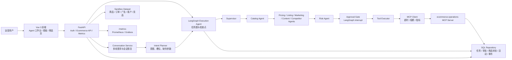

# 智能电商运营 Agent

基于 **LangGraph + MCP + FastAPI + Vue 3** 的执行型电商运营 Agent。用户通过自然语言下达调价、商品上架、商品下架、营销活动和推广文案任务，系统完成多 Agent 路由、策略校验、人工审批、工具执行、结果交付和回滚。

> 项目使用可复现的模拟电商数据和沙箱业务系统，不连接淘宝、京东、Amazon 等真实平台。

## 项目背景

电商运营的日常工作通常横跨商品、价格、库存、广告、内容和客户分层等多个模块。一个看似简单的运营动作，例如“给某个商品降价并投放推广”，背后往往需要先查看商品状态、核对成本和毛利、判断库存风险、生成活动参数、提交人工审批，再由不同系统完成执行和复盘。传统流程依赖人工在多个后台之间切换，信息容易割裂，执行链路也难以追踪。

大模型可以提升运营分析和方案生成效率，但如果直接让 LLM 调用业务写工具，会带来明显风险：它可能误判商品、缺少关键参数、绕过审批、重复执行，或者在工具失败后无法恢复现场。因此，真实业务场景需要的不是“能聊天的运营助手”，而是一个带有权限、证据、审批、工具边界和回滚机制的执行系统。

本项目基于这个问题设计了一个沙箱版智能电商运营 Agent：用模拟电商数据还原经营诊断、商品分析、竞品分析、文案生成、调价、上架/下架和营销活动创建等典型场景；用 LangGraph 编排多 Agent 协作；用 MCP 隔离工具调用；用 RBAC、审批门、版本校验和持久化事件记录控制业务写入风险。它的目标是展示“AI 运营决策如何从建议走向可控执行”，而不是宣称已经接入真实电商平台。

## 项目定位

这个项目不是单轮问答机器人，而是一个“能分析、能规划、能审批、能执行、能回滚”的电商运营 Agent 系统。它模拟了真实电商团队里的几类工作：

- 运营人员用自然语言提出目标，例如分析 GMV 下滑、优化广告 ACOS、生成小红书文案、调整商品价格、上架/下架商品或创建推广活动。
- 系统先判断这是只读分析、内容生成还是业务写操作，再把任务交给合适的专业 Agent。
- 只读任务会输出带证据的数据报告；写操作必须经过风险判断和人工审批。
- 审批通过后，Tool Executor 通过 MCP Server 修改沙箱业务状态，并记录工具回执、任务事件和可回滚快照。

项目重点展示的是执行型 Agent 的工程闭环：意图识别、上下文管理、专业 Agent 分工、审批中断恢复、工具协议隔离、持久化状态、多租户权限和可观测性。

## 架构总览



核心分层可以这样理解：

| 层级 | 作用 | 主要代码 |
|---|---|---|
| 前端交互层 | 登录、会话、任务创建、审批、执行轨迹、经营看板和商品分析 | `frontend/src/views/Ecommerce/*`、`frontend/src/api/client.ts` |
| API 层 | 暴露电商 Agent、会话、审批、回滚、看板、仿真和健康检查接口 | `backend/main.py`、`backend/api/ecommerce.py`、`backend/api/auth.py` |
| Agent 编排层 | 用 LangGraph 组织 Supervisor、专业 Agent、审批门和工具执行器 | `backend/ecommerce/execution_graph.py` |
| 意图与会话层 | 识别用户目标、补齐参数、多轮追问、恢复原任务上下文 | `backend/ecommerce/intent_planner.py`、`backend/ecommerce/conversation.py` |
| 专业能力层 | 商品分析、竞品分析、广告优化、客户分层、内容生成和风险校验 | `backend/ecommerce/specialists.py`、`backend/ecommerce/operations_tools.py` |
| 工具协议层 | 通过 MCP 调用沙箱业务工具，隔离工具会话并统一返回 `ToolResponse` | `backend/ecommerce/mcp_client.py`、`backend/mcp_servers/ecommerce_server.py` |
| 持久化层 | 保存任务、会话、审批、工具执行、活动、商品状态和 LangGraph 检查点 | `backend/ecommerce/persistence/*`、`backend/db/alembic/versions/*` |
| 运维观测层 | 健康检查、Prometheus 指标、生产配置、Docker Compose 和发布清单 | `backend/middleware/production.py`、`ops/*`、`docker-compose*.yml` |

## 一次任务如何执行

以“把轻量跑步鞋调价到 269 元并创建推广活动”为例，系统会经历以下步骤：

1. 前端把自然语言目标提交到 `/api/ecommerce/conversations/messages` 或 `/api/ecommerce/execution/tasks`。
2. `OperationsIntentPlanner` 识别商品、动作、价格、渠道、预算等槽位；如果缺少关键信息，会把待补充状态保存到会话，再向用户追问。
3. `Supervisor` 把复合任务拆成 DAG：先执行调价，再创建营销活动。
4. `Catalog Agent` 通过 MCP 读取商品当前价格、状态和 `catalog_version`。
5. `Pricing Agent` 校验调价幅度、成本底线和毛利率；`Marketing Agent` 生成活动预算、目标 ACOS 和投放渠道。
6. `Risk Agent` 根据动作类型和价格变化判断审批等级，例如普通用户、editor 或 admin。
7. `Approval Gate` 使用 LangGraph `interrupt` 暂停任务，前端展示审批卡片和风险理由。
8. 用户审批后，系统带着 `expected_version` 恢复同一个 LangGraph 线程，避免重复执行旧状态。
9. `Tool Executor` 通过 MCP 调用 `update_product_price` 和 `create_marketing_campaign`；如果后置步骤失败，会调用 `rollback_product` 恢复调价前快照。
10. 任务事件、工具回执、审批记录和最终结果写入数据库，前端可以展示完整执行轨迹。

这个链路的关键点是：LLM 负责理解和生成，但业务写入不直接交给 LLM。真正修改状态的工具调用必须经过结构化参数、角色审批、版本校验、MCP Server 二次校验和可观测记录。

## 适合展示的工程亮点

- **执行型 Agent 架构**：不是只输出建议，而是能把任务推进到审批、工具执行、状态变更和回滚。
- **多 Agent 分工**：Supervisor 负责路由，Catalog/Pricing/Listing/Marketing/Content/Competitor/Risk 等 Agent 各自处理清晰边界。
- **LangGraph 中断恢复**：审批点使用 `interrupt` 暂停，审批后从检查点恢复执行，适合真实业务里的人工确认流程。
- **MCP 工具隔离**：工具执行通过独立 MCP Server 完成，业务写工具不暴露给通用对话 Agent。
- **双层安全校验**：API 层做 RBAC 和租户隔离，MCP Server 再校验任务、审批状态、动作、商品、参数和版本。
- **证据化分析**：分析报告必须包含数据源、周期和样本量，避免凭空生成运营结论。
- **确定性降级**：DeepSeek 未配置或调用失败时，系统仍能用规则规划和模板生成保证演示可运行。
- **生产化意识**：包含健康检查、Prometheus 指标、Grafana 面板、发布清单、Docker Compose 和迁移契约测试。

## 核心流程

```text
用户对话 -> Intent Planner -> 参数完整性检查
  -> 信息不足：保存会话状态 -> 主动追问 -> 用户补充 -> 恢复原任务
  -> 只读分析：专业 Agent -> 沙箱数据工具 -> Evidence Critic -> 证据化报告
  -> 内容交付：商品事实 -> DeepSeek 生成 -> 失败时明确模板降级
  -> 业务写入：LangGraph 计划 -> 分级审批 -> MCP 执行 -> 验证/回滚
  -> 自动化：生成默认禁用的规则草案 -> 人工审核后再启用
```

## 支持的运营能力

| 能力 | 示例 | 行为 |
|---|---|---|
| 经营诊断 | `分析最近30天 GMV 为什么下降` | 汇总商品贡献、流量、广告和库存证据 |
| 商品运营 | `看看轻量跑步鞋的转化和库存` | 返回商品指标、风险与动作建议 |
| 竞品分析 | `给便携榨汁杯做小红书竞品分析` | 对比价格、促销和评价，不创建活动 |
| 内容运营 | `给便携榨汁杯写推广文案` | 缺渠道时追问，补充后生成渠道化内容 |
| 营销运营 | `给轻量跑步鞋做营销方案` | 输出策略；明确“创建活动”时才进入审批 |
| 广告优化 | `优化轻量跑步鞋的广告 ACOS` | 基于广告 ROI、转化和归因数据给出动作 |
| 客户运营 | `分析高价值客户复购和召回机会` | 客户分层、复购识别和召回建议 |
| 自动执行 | `调价到269元`、`下架P003` | 审批后调用 MCP 修改沙箱业务状态 |
| 自动化规则 | `每天自动检查库存风险` | 保存为禁用草案，避免未经批准自动运行 |

## 自主闭环运行

对于带有 KPI、周期和预算的复杂目标，系统进入自主闭环模式：

```text
Goal Contract
  -> Dynamic Planner
  -> Product / Competitor / Content Agents
  -> Sandbox Experiment
  -> Outcome Evaluator
  -> Evidence Critic
  -> Replan（未达标）
  -> Memory Consolidator（达标）
```

示例：

```text
用户：自主提升便携榨汁杯转化率
Agent：目标提升多少？多少天？预算上限是多少？
用户：未来 7 天提升 15%，预算 1000 元
Agent：生成动态 DAG，运行沙箱实验，评价 KPI；首轮未达标时反思并重规划，达标后停止。
```

运行时约束：

- 每次自主目标都必须包含商品、KPI 目标、观察周期和预算上限。
- 沙箱分析与实验可以自动运行；真实业务写操作仍进入角色审批和 MCP 校验。
- 每个步骤后保存 Observation 和检查点，工具中断后可在同一任务 ID 上恢复。
- 未达标时 Critic 记录差距、证据步骤和下一轮调整；达到最大轮次或预算上限时自动停止。
- 成功后写入情景记忆、成功 SOP、商品语义事实和用户预算偏好。
- 后续同商品、同 KPI 目标只召回来源可信且评价成功的 SOP，冲突或失败记忆不会进入规划。

自主实验的 KPI 变化来自项目内沙箱模拟器，用于验证 Agent 闭环，不代表真实平台的因果实验结果。

## HelloAgents 工程模式

项目参考 [HelloAgents](https://github.com/jjyaoao/HelloAgents) 的工程实践，并按电商领域约束完成以下适配：

- GSSC 上下文管线与 token 预算，替代简单字符截断。
- Agent 工具能力注册、只读/沙箱/业务写入分级和审批范围过滤。
- Critic 对目标进展、证据、安全和成本效率进行量化评分。
- 统一运行 Trace，记录步骤、错误、重规划、模型和工具事件。

完整采用与取舍记录见 `docs/HELLOAGENTS_ADOPTION.md`。项目没有替换已有 LangGraph、MCP、ToolResponse、熔断和 SQL 持久化，也没有让通用 ReAct Agent 绕过审批直接持有业务写工具。

## Agent 职责

| Agent | 职责 |
|---|---|
| Supervisor | 通过 Pydantic 结构化输出识别动作、商品和参数；LLM 不可用时确定性降级 |
| Catalog Agent | 通过 MCP 读取当前商品状态和版本 |
| Pricing Agent | 校验调价幅度、成本底线和毛利率 |
| Listing Agent | 准备上架或下架变更 |
| Marketing Agent | 生成营销活动预算和参数 |
| Content Agent | 调用 DeepSeek 生成渠道化推广文案；失败时提供明确标识的模板降级结果 |
| Risk Agent | 判断风险并生成 user/editor/admin 分级审批要求 |
| Approval Gate | 使用 LangGraph `interrupt` 暂停任务 |
| Tool Executor | 审批后执行 MCP 工具或复合任务 DAG，失败时执行补偿动作 |

复合指令（例如“调价并创建推广活动”）会被拆成有依赖关系的步骤：先调价，再创建活动；后置步骤失败时通过 MCP 恢复商品快照。每个步骤状态、工具名和执行回执都会写入任务结果。

## MCP Server

项目使用官方 Python MCP SDK，通过隔离的 stdio Session 调用独立 `ecommerce-operations` MCP Server。每次工具调用拥有独立会话，避免 MCP SDK 的 AnyIO cancel scope 跨 FastAPI 请求任务共享。

| Tool | 功能 |
|---|---|
| `get_product` | 查询商品价格、成本、状态和版本 |
| `update_product_price` | 更新商品价格 |
| `set_product_listing` | 上架或下架商品 |
| `rollback_product` | 恢复执行前快照 |
| `create_marketing_campaign` | 创建沙箱营销活动 |

所有写工具必须携带 `approved_task_id`，并使用 `expected_version` 进行乐观锁校验。MCP Server 会再次校验任务租户、运行状态、审批状态、动作类型、商品和参数，防止客户端篡改。工具统一返回 `ToolResponse`，包含状态、错误码、可重试标记和结构化数据。MCP Client 支持超时、失败熔断及 Prometheus 调用次数和延迟指标。

## 工程能力

- **多租户与 RBAC**：JWT 携带 `workspace_id` 和角色；任务查询按租户隔离，只读角色禁止写操作。
- **分级审批**：普通变更由 user 批准，10% 以上调价需要 editor，15% 以上需要 admin。
- **持久化恢复**：任务、事件、活动和商品状态写入 SQL 数据库；LangGraph 使用 `AsyncSqliteSaver` 保存执行检查点，可在进程重启后恢复。
- **上下文工程**：Supervisor 读取当前工作区最近任务，并按字符与估算 token 预算裁剪，避免历史无限增长。
- **多轮澄清**：会话持久化待补充目标与参数，用户回答后恢复原始任务，而不是重新猜测意图。
- **证据约束**：分析报告中的指标附带数据源、周期和样本量；不允许虚构竞品品牌、促销、认证或功效。
- **可观测性**：`/metrics` 暴露 MCP 调用状态和延迟；任务事件记录规划、审批、工具调用和回滚轨迹。
- **意图边界**：推广文案路由到 Content Agent 并交付标题、正文、卖点、CTA 和标签；只有明确要求创建活动时才写入营销活动与预算。
- **并发一致性**：商品写入使用版本号乐观锁；审批接口要求任务版本，重复提交会得到冲突响应。

## 页面

- **执行型 Agent**：创建任务、查看多 Agent 轨迹、审批、执行、查看 MCP 回执和回滚。
- **经营数据**：GMV、漏斗、趋势预测和经营异常。
- **商品分析**：价格、毛利、库存、广告、评价、竞品价格和模拟变化。

## 技术栈

- Agent：LangGraph 1.x
- 协议：Model Context Protocol Python SDK
- 后端：FastAPI、Pydantic、SQLAlchemy Async
- 数据库：SQLite（本地）/ PostgreSQL（可配置）
- 前端：Vue 3、TypeScript、Element Plus、Vite
- 测试：pytest、Playwright、vue-tsc

## 启动

```powershell
python -m venv .venv
.venv\Scripts\python.exe -m pip install -r backend\requirements.txt
.venv\Scripts\python.exe -m pip install -r backend\requirements-langchain.txt

.venv\Scripts\python.exe -m uvicorn backend.main:app --host 127.0.0.1 --port 8001
```

```powershell
cd frontend
npm install
$env:VITE_API_TARGET="http://127.0.0.1:8001"
npm run dev -- --host 127.0.0.1 --port 5173
```

访问 `http://127.0.0.1:5173/agent`。

## 验证

```powershell
.venv\Scripts\python.exe -m pytest -q
cd frontend
npm run build
npm run test:e2e
```

## 项目边界

- 商品、订单、库存、广告和竞品数据均为模拟数据。
- MCP Server 当前连接项目内沙箱适配器，不连接真实电商平台。
- 所有业务写操作都经过人工审批，高风险操作要求更高角色。
- 当前 LLM 可通过配置接入，未配置或调用失败时由确定性 Supervisor 保证演示可运行。
- 接入真实平台时仍需要实现平台 OAuth、真实适配器、限流与幂等键、密钥托管、告警和灾备；本项目不声称已直接控制生产店铺。
